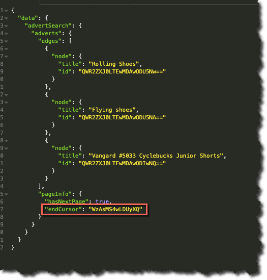

### What you’ll learn

In this article you’ll learn about pagination, specifically:

- Result set size
- Cursors (moving forward and backwards)


### What is pagination?

Pagination (or paging) is the process of dividing a document, (in our case a GraphQL JSON result-set), into a sequence of pages that are then “numbered”. 

In the context of a GraphQL result set this means that we can deal more effectively with large sets of data, i.e. we don’t need to have the entire result set returned in 1 request, instead splitting it up into pages and then moving through, (retrieving), those pages as required.

Using pagination we can move forwards or backwards through a result set.

### Using Pagination in your queries

We make use of the [Relay Specification](https://relay.dev/graphql/connections.htm), which is specifically designed to allow us to use pagination best practices. In this article we’ll go through the basics of how to query using pagination, but for a full discussion please refer to the Relay Specification documentation.


#### Specifying the “page size”

Probably the first thing to consider is what “size” you want your result set to be, and by that we mean the max number of objects returned per request. You can specify this in 1 of 2 ways, using either:

-	First – used in forward pagination
-	Last – used in backward pagination

For the purposes of this discussion we’re going to focus on _forward pagination_.

So requesting the “first” 3 Adverts using `advertSearch`, would look something like this:

```graphql
    {
      advertSearch{
        adverts(first: 3) {
          edges {
            node {
              title
              id
            }
          }
        }
      }
    }
```

Executing that query will return _up to_ 3 Advert objects, (assuming there are 3 or more published adverts on the marketplace).

For example:


That’s great and everything, but how do we get to see the next page, (if there is one)?


#### Do we have more pages?

In order to retrieve the next page of data, we first need to determine if indeed there is a next page, (we have more than 3 Adverts), or if in fact there isn’t a next page (we have 3 or fewer Adverts).

To do this we introduce the use of `pageInfo`.

Updating our query to the following details the use of `pageInfo`:

    {
      advertSearch{
        adverts(first: 3) {
          edges {
            node {
              title
              id
            }
          }
            pageInfo {
              hasNextPage
          }
        }
      }
    }


Running that query again and examining the JSON payload we can see:


In this case `pageInfo` and specifically `hasNextPage` tells us that we do indeed have more pages…


#### Introducing our cursor

To retrieve the next page of data we need to know how to _get to_ the next page, we do this by specifying `endCursor` in `pageInfo` as follows:

```graphql
    {
      advertSearch{
        adverts(first: 3) {
          edges {
            node {
              title
              id
            }
          }
          pageInfo {
            hasNextPage
            endCursor
          }
        }
      }
    }
```

This will yield the following result:




We can then “request” this page of data the next time we make a request, we do this by updating our query as follows:

```graphql
    {
      advertSearch{
        adverts(first: 3, after: "WzAsMS4wLDUyXQ") {
          edges {
            node {
              title
              id
            }
          }
          pageInfo {
            hasNextPage
            endCursor
          }
        }
      }
    }
```

Noting that we have used the value of `endCursor` from our previous query as the value of the `after` parameter.

This will result in the next page of 3 Adverts, observing that we now have a different value for `endCursor` that will be use to retrieve the next page, and so it goes on...


### Moving Backwards

Moving backwards is no more difficult, we just need to use slightly different terms, the table below contrasts and compares what we did for moving forward with the equivalent for moving backwards.

&nbsp;| Moving Forwards | Moving Backwards
---|---|---
**Specify Page Size** | first | last
**Determine Page Availablity** | hasNextPage | hasPreviousPage
**Get Cursor** | endCursor |startCursor
**Use Cursor** | after | before