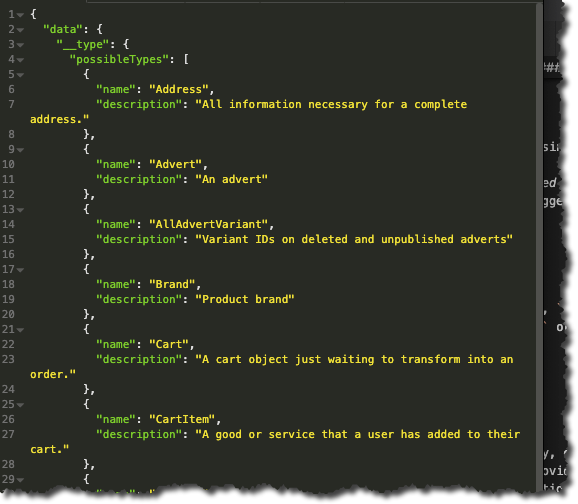
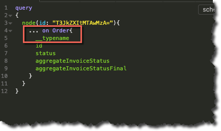
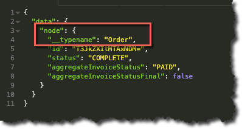

### What you’ll learn

In this article you’ll learn:

- How to use `node` and `nodes` to query with GraphQL
- Why you would do this

> “Node” in the context of this article refers to the "node" concept in graph theory, not the popular JavaScript framework!

### Why query with Node?

The Marketplacer GraphQL API provides a number of predefined queries that address the most common use-cases when attempting to build an app on top of Marketplacer, for example:

Query | What does it do
---|---
`advertSearch` | Provides the most flexible way to search for _published adverts_ using a number of criteria, e.g.: `maxPrice`, `Seller Id`, `updatedSince` etc.
`allAdverts` | Gives us the ability to search for _published, unpublished and deleted adverts_
`textQuerySuggestions` | Allows us to query for Brand and Categorization (Taxon) suggestions based on free-text input

 

The full list of queries is available in our [full documentation](/graphql).

However, there may be instances where you need to retrieve objects, (e.g. `country`, `prototype`, `shipment` etc.), where there isn’t a predefined query, in this case you may be able to use the `node` or `nodes` construct.

This type of query is suitable when:

-	The object (e.g. `invoice`, `lineItem` etc.) “implements” `node`
-	You want to query based on the object ID(s)

> **What is "node"?** The concepts of “nodes” and “edges” are common to graph theory, essentially providing an elegant way to represent hierarchical data.  Our [Getting Started docs](getting_started) provide a further overview of how this works, including the fact that we implement nodes and edges via the [Relay Specification](https://relay.dev/graphql/connections.htm).

### Which objects implement node?

To see which objects _implement node_, and are therefore available query using “node”, we need to perform an _introspection query_. An introspection query, as the name suggests, allows us to “query ourself” to return some kind of meta-information – in this case a list of objects that implement node.

The query is as follows:

    {
        __type(name: "Node") {
            possibleTypes {
                name
                description
            }
        }
    }

This should yield results similar to the following, (at least using the Marketplacer API!):

### Query using node

 Armed with:

-	The list of objects that implement node
-	The IDs of the objects we want to search for

We can query for either individual objects (`node`) or multiple objects (`nodes`) as shown in the examples below:

#### Node example (Query an Order)

    query
    {
        node(id: "T3JkZXItMTAwMzA="){
            ... on Order{
                __typename
                id
                status
                aggregateInvoiceStatus
            }
        }
    }

 

Examining the query further, specifically the highlighted section:

You’ll note that we:

- Use a _fragment_ to specify that we want to query on an `order`
- We specify the `__typename` as a return attribte in our query, this is somewhat redundant but helps illustrate the point, as shown in the query results below:

 

 

#### Nodes example (Query Invoices)

    query
    {
        nodes(ids: [
            "SW52b2ljZS0xMDAzMA==",
            "SW52b2ljZS0xMDAzMQ==",
            "SW52b2ljZS0xMDAyOQ=="
        ])
        {
            ... on Invoice{
                __typename
                id
                status
                shipments{
                    carrier
                }
            }
        } 
    }