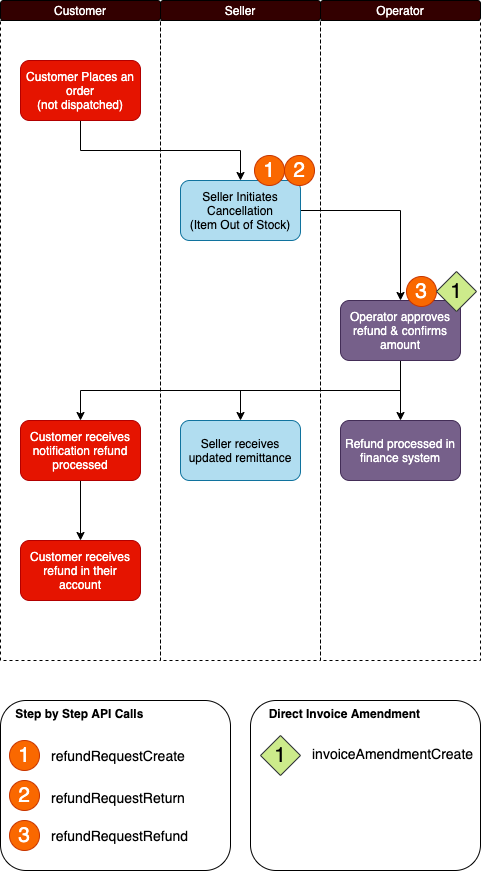
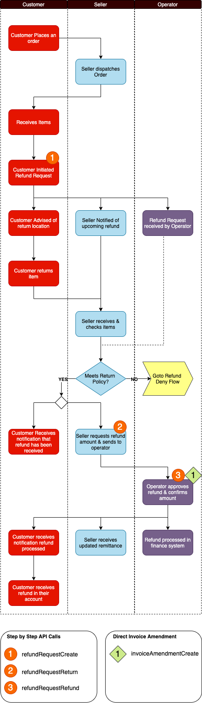
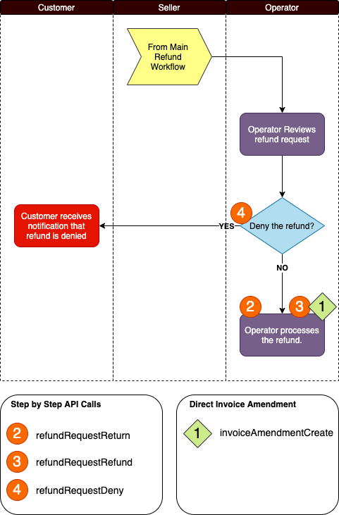

### What you’ll learn

In this how to we take you through how to perform returns and invoice amendments with GraphQL, we cover:

- Key concepts and terms
- Processes for returning (& refunding)
- The GraphQL API calls you'll need to make

### Key Terms

Before launching into the processes that can be followed, it’s worth clarifying the language and terms used when we talk about refunds and returns.

Term | Description
---|---
**Cancellation** (Process) | Cancellation occurs before purchased items are dispatched. So for example, a Seller may wish to cancel the order if they have run out of stock.
**Return** (Process) | This is the term we use when an order has been dispatched, and the customer wishes to return it for a refund. An example of this is that the item did not meet the customers expectations and they do not want a replacement. **Note:** the "successful" outcome of the return process will result in the _return_ of the item and a _refund_ of money.
**Exchange** (Process) | The Exchange process occurs when the order has been dispatched and the Customer wishes to swap (exchange) it for another item. For example the dispatched item was faulty, and the customer would like a replacement. Exchanging is not currently supported.
**Refund Request** (Entity) | A Refund Request is created when either the Cancellation or Return process is initiated. It is the primary vehicle used to manage the lifetime of this request. A successful Refund Request will ultimately result in an Invoice Amendment.
**Invoice Amendment** (Entity) | An Invoice Amendment will be made to a customer invoice if there needs to be any kind of adjustment following a successful Refund Request, (either the Cancellation or Return process). Note that an Invoice Amendment can be created directly on an Invoice without needing to create a Refund Request, (“short circuiting the process”).
**Headless** | A headless Marketplacer deployment is where the marketplace operator has chosen not to use the Marketplacer customer-facing store, instead opting for their own front end. **Note:** the Operator and Seller Portals are still in use.
**Full-stack** | A full-stack Marketplacer deployment is where the marketplace operator has opted to use the full functionality of the Marketplacer stack, including the customer-facing Marketplacer front end.

### Processes

In the section that follows we outline the process flows for:

- The Cancellation workflow
- The Return workflow
- The Deny workflow

In all cases we overlay with the relevant API calls that can be made at each step. The reader should note the following points when using the API:

- Use **either** the _Direct Invoice Amendment_ approach **or** the _Step by Step Approach_ (the step by Step approach ultimately results in an Invoice Amendment)
- It is advised that _Headless_ customers use the Direct Invoice Amendment approach as the Step by Step approach is really designed to emulate the customer initiated cancellation / return process. It may therefore not be appropriate to use the step by step approach in a headless implementation. 

#### Cancellation Process

The **Cancellation Process** occurs when an order has not yet been dispatched. 

#### Return Process

The **Return Process** occurs when an order has been dispatched.

#### Deny Process

The **Deny Process** follows on from the Return Process

### API Calls

It is advised that the reader refer to either the [Full Reference Documentation](/graphql) or [GraphQL Voyager](/graphql-voyager) for the latest information relating to the API Calls referenced in this document. Note, both sources present the same schema, (with associated documentation), but using different formats / presentation styles. 

However for reference, a summary of the calls have been provided below:

**API** | **Description** | **Results In...**
**refundRequestCreate** | Initiates either the Cancellation or Return Process | Results in the Creation of a `RefundRequest` with the Status of: **AWAITING**
**refundRequestReturn** | Acknowledges the Return of Items | Results in the the status of the `RefundRequest` being updated to: **RETURNED**
**refundRequestRefund** | Finalises either the Cancellation or Return Process | Results in the status of the `RefundRequest` being updated to: **REFUNDED**, also results in the creation of an `InvoiceAmendment`
**refundRequestDeny** | Used to deny a Refund Request | Results in the the status of the `RefundRequest` being updated to: **DENY**
**updatedRefundRequests** | Used to return all Refund Requests updated from a given timestamp | Results in a object array of Refund Requests (which can be empty)
**invoiceAmendmentCreate** | Used to directly amend an invoice without the need to go through the step by step flow. It is advised that headless implementations use this approach | Results in an amended Invoice with associated `InvoiceAmendment` record.

### Considerations

Return & Refund processes are complex and fraught with nuance, with this in mind we have provided some additional considerations for the reader:

- The Seller Portal will be in use even for Headless deployments, so a Refund Request can be generated by a Seller using this option. Therefore while _consumer_ initiated returns will be managed by the operators front end, _seller_ initiated returns can be generated via this path and will need to be considered as part of the overall Return Process.
- Webhooks can be employed in addition to the API’s outlined above to provide near real time event notifications on Refund Requests. You can [read more about webhooks here](/webhooks/overview).