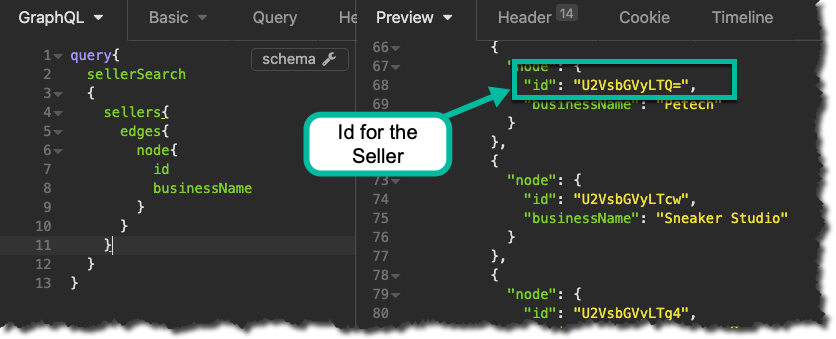
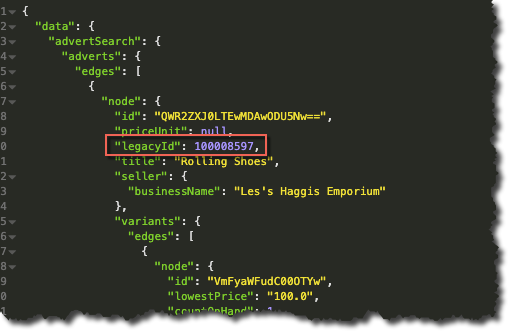
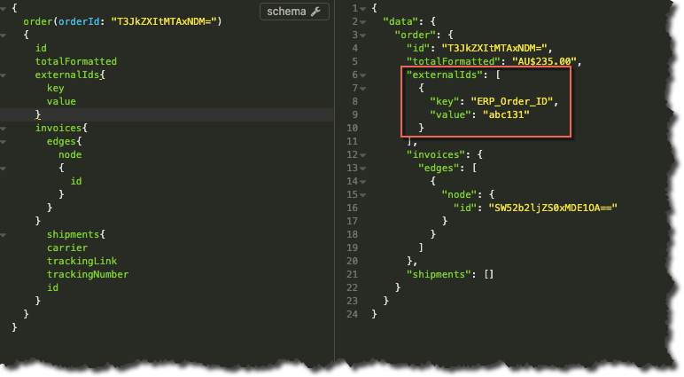

### What you’ll learn

In this article you’ll learn:

- How Object IDs are formatted in the GraphQL API
- What Legacy IDs are 
- What External IDs are

### GraphQL IDs

Performing a simple query to return all Sellers via GraphQL, (and ensuring that you include the ID attribute in your requested result set), will look similar to the following:

The IDs returned for the Sellers, (as is the case for all object IDs in GraphQL), are in base64, for example:

- `U2VsbGVyLTc4`

Using a conversion tool to decode from Base64, (e.g. https://www.base64decode.net/) will yield the following:

- `Seller-78`

A non-exhaustive list of examples for other object types are given below:

Object | Converted ID
---|---
Advert | `Advert-100008594`
Order | `Order-10033`
Invoice | `Invoice-10056`
Seller | `Seller-78`
Variant | `Variant-4959`
LineItem | `LineItem-64`
Shipment | `Shipment-13`

So typically:

- Base64 IDs will be used when working with IDs directly in GraphQL
- IDs converted from Base64 representations can be used to cross reference with Objects in the REST API, but you should really use _Legacy IDs_ for that 

### Legacy IDs

The LegacyID attribute is available on some GraphQL objects, e.g.:

- Advert
- Variant
- Taxon
- Invoice

This attribute can be used to retrieve the ID of the object as it would appear in the Seller API without having to resort to any type of conversion:

So just to compare and contrast the ID in the above example:

GraphQL ID (Base64) | GraphQL ID (Converted) | REST ID
---|---|---
QWR2ZXJ0LTEwMDAwODU5Nw== | Advert-100008597 | 100008597

### External IDs

When creating objects with GraphQL you may want to provide an “External ID”. This ID will typically map to the ID of another (3rd party) system that manages representations of the same type of object. 

> E.g. you may track “order” objects in your own ERP System, so when you come to create an Order in Marketplacer via the GraphQL API, you may want to associate the ERP Order ID with the Order you create in Marketplacer.

External ID’s can therefore be retrieved, (queried), as shown in the example below, where we created an order with an External ID:

You can see that the External ID in this instance is comprised of:

- `Key`: The “name” of the Key, e.g. ERP_Order_ID
- `Value`: The actual value of the external id

> **Gotcha!** Make sure you supply unique External ID’s with every mutation, (request to create an object), as duplicates will result in the non-creation of your object!

#### ExternalIds Vs ExternalId

There is currently an additional `ExternalID`, (singular), attribute that is exposed via GraphQL, this attribute can be set by either:

- The REST API
- Integrations Manager (the tool that loads data from 3rd party eCom providers e.g. Shopify)
 
While this attribute can be queried by GraphQL, it cannot be set here, so in short - `ExternalIDs` (plural) should be used when developing with GraphQL.